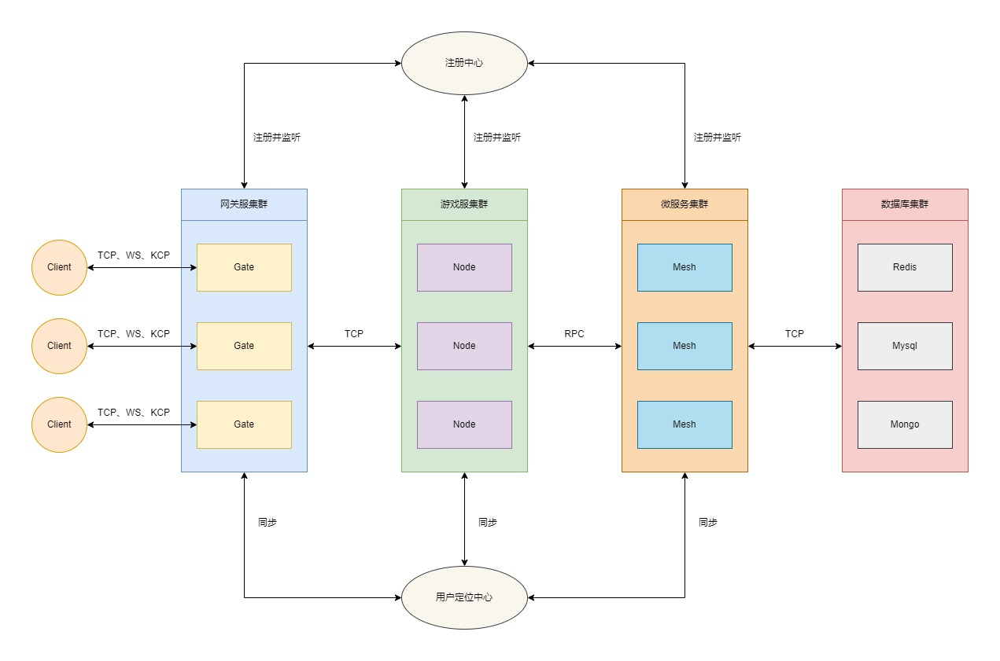

# dawn 基于Go语言开发的高性能分布式游戏服务器框架

### 1.介绍

是一款基于Go语言开发的轻量级、高性能分布式游戏服务器框架。
其中，模块设计方面借鉴了[kratos](https://github.com/go-kratos/kratos)的模块设计思路，旨在为游戏服务器开发提供完善、高效、优雅、标准化的解决方案。
框架自创建至今已在多个企业级游戏项目中上线实践过，稳定性有充分的保障。



### 2.优势

* 💰 免费性：框架遵循MIT协议，完全开源免费。
* 💡 简单性：架构简单，源码简洁易理解。
* 🚠 便捷性：仅暴露必要的调用接口，减轻开发者的心智负担。
* 🚀 高性能：框架原生实现集群通信方案，普通机器单线程也能轻松实现20W的TPS。
* 🧊 标准化：框架原生提供标准化的开发规范，无论多么复杂的项目也能轻松应对。
* ✈️ 高效性：框架原生提供tcp、kcp、ws等服务器，方便开发者快速构建各种类型的网关服务器。
* ⚖️ 稳定性：所有发布的正式版本均已通过内部真实业务的严格测试，具备较高的稳定性。
* 🎟️ 扩展性：采用良好的接口设计，方便开发者设计实现自有功能。
* 🔑 平滑性：引入信号量，通过控制服务注册中心来实现优雅地滚动更新。
* 🔩 扩容性：通过优雅的路由分发机制，理论上可实现无限扩容。
* 🔧 易调试：框架原生提供了tcp、kcp、ws等客户端，方便开发者进行独立的调试全流程调试。
* 🧰 可管理：提供完善的后台管理接口，方便开发者快速实现自定义的后台管理功能。

### 3.功能

* 网关：支持tcp、kcp、ws等协议的网关服务器。
* 日志：支持console、file、aliyun、tencent等多种日志组件。
* 注册：支持consul、etcd、nacos等多种服务注册中心。
* 协议：支持json、protobuf、msgpack等多种通信协议。
* 配置：支持consul、etcd、nacos等多种配置中心；并支持json、yaml、toml、xml等多种文件格式。
* 通信：支持grpc、rpcx等多种高性能通信方案。
* 重启：支持服务器的平滑重启。
* 事件：支持redis、nats、kafka、rabbitMQ等事件总线实现方案。
* 加密：支持rsa、ecc等多种加密方案。
* 服务：支持grpc、rpcx等多种微服务解决方案。
* 灵活：支持单体、分布式等多种架构方案。
* Web：提供http协议的fiber服务器及swagger文档解决方案。
* 工具：提供脚手架工具箱，可快速构建集群项目。
* 缓存：支持redis、memcache等多种常用的缓存方案。
* Actor：提供完善actor模型解决方案。
* 分布式锁：支持redis、memcache等多种分布式锁解决方案。

### 4.下一期新功能规划

* 分布式任务调度系统

### 5.特殊说明

> 在dawn交流群中经常有小伙伴提及到Gate、Node、Mesh之间到底是个什么关系，这里就做一个统一的解答

* Gate：网关服，主要用于管理客户端连接，接收客户端的路由消息，并分发路由消息到不同的的Node节点服。
* Node: 节点服，作为整个集群系统的核心组件，主要用于核心逻辑业务的编写。Node节点服务可以根据业务需要做成有状态或无状态的节点，当作为无状态的节点时，Node节点与Mesh微服务基本无异；但当Node节点作为有状态节点时，Node节点便不能随意更新进行重启操作。故而Node与Mesh分离的业务场景的价值就体现出来了。
* Mesh：微服务，主要用于无状态的业务逻辑编写。Mesh能做的功能Node一样可以完成，如何选择完全取决于自身业务场景，开发者可以根据自身业务场景灵活搭配。

### 6.通信协议

在dawn框架中，通信协议统一采用size+header+route+seq+message的格式：

1.数据包

```
 0 1 2 3 4 5 6 7 0 1 2 3 4 5 6 7 0 1 2 3 4 5 6 7 0 1 2 3 4 5 6 7 0 1 2 3 4 5 6 7 0 1 2 3 4 5 6 7 0 1 2 3 4 5 6 7 0 1 2 3 4 5 6 7 0 1 2 3 4 5 6 7
+---------------------------------------------------------------+-+-------------+-------------------------------+-------------------------------+
|                              size                             |h|   extcode   |             route             |              seq              |
+---------------------------------------------------------------+-+-------------+-------------------------------+-------------------------------+
|                                                                message data ...                                                               |
+-----------------------------------------------------------------------------------------------------------------------------------------------+
```

2.心跳包

```
 0 1 2 3 4 5 6 7 0 1 2 3 4 5 6 7 0 1 2 3 4 5 6 7 0 1 2 3 4 5 6 7 0 1 2 3 4 5 6 7 0 1 2 3 4 5 6 7 0 1 2 3 4 5 6 7 0 1 2 3 4 5 6 7 0 1 2 3 4 5 6 7
+---------------------------------------------------------------+-+-------------+---------------------------------------------------------------+
|                              size                             |h|   extcode   |                      heartbeat time (ns)                      |
+---------------------------------------------------------------+-+-------------+---------------------------------------------------------------+
```

size: 4 bytes

- 包长度位
- 固定长度为4字节，且不可修改

header: 1 bytes

h: 1 bit

- 心跳标识位
- %x0 表示数据包
- %x1 表示心跳包

extcode: 7 bit

- 扩展操作码
- 暂未明确定义具体操作码

route: 1 bytes | 2 bytes | 4 bytes

- 消息路由
- 默认采用2字节，可通过打包器配置packet.routeBytes进行修改
- 不同的路由对应不同的业务处理流程
- 心跳包无消息路由位
- 此参数由业务打包器打包，服务器开发者和客户端开发者均要关心此参数

seq: 0 bytes | 1 bytes | 2 bytes | 4 bytes

- 消息序列号
- 默认采用2字节，可通过打包器配置packet.seqBytes进行修改
- 可通过将打包器配置packet.seqBytes设置为0来屏蔽使用序列号
- 消息序列号常用于请求/响应模型的消息对儿的确认
- 心跳包无消息序列号位
- 此参数由业务打包器packet.Packer打包，服务器开发者和客户端开发者均要关心此参数

message data: n bytes

- 消息数据
- 心跳包无消息数据
- 此参数由业务打包器packet.Packer打包，服务器开发者和客户端开发者均要关心此参数

heartbeat time: 8 bytes

- 心跳数据
- 数据包无心跳数据
- 上行心跳包无需携带心跳数据，下行心跳包默认携带8 bytes的服务器时间（ns），可通过网络库配置进行设置是否携带下行包时间信息
- 此参数由网络框架层自动打包，服务端开发者不关注此参数，客户端开发者需关注此参数

### 7.相关工具链

1.安装protobuf编译器（使用场景：开发mesh微服务）

- Linux, using apt or apt-get, for example:

```shell
$ apt install -y protobuf-compiler
$ protoc --version  # Ensure compiler version is 3+
```

- MacOS, using Homebrew:

```shell
$ brew install protobuf
$ protoc --version  # Ensure compiler version is 3+
```

- Windows, download from [Github](https://github.com/protocolbuffers/protobuf/releases):

2.安装protobuf go代码生成工具（使用场景：开发mesh微服务）

```shell
go install google.golang.org/protobuf/cmd/protoc-gen-go@latest
```

3.安装grpc代码生成工具（使用场景：使用[GRPC](https://grpc.io/)组件开发mesh微服务）

```shell
go install google.golang.org/grpc/cmd/protoc-gen-go-grpc@latest
```

4.安装rpcx代码生成工具（使用场景：使用[RPCX](https://rpcx.io/)组件开发mesh微服务）

```shell
go install github.com/rpcxio/protoc-gen-rpcx@latest
```

5.安装gorm dao代码生成工具（使用场景：使用[GORM](https://gorm.io/)作为数据库orm）

```shell
go install github.com/dobyte/gorm-dao-generator@latest
```

6.安装mongo dao代码生成工具（使用场景：使用[MongoDB](https://github.com/mongodb/mongo-go-driver)作为数据库orm）

```shell
go install github.com/dobyte/mongo-dao-generator@latest
```

### 8.配置中心

1.功能介绍

配置中心主要定位于业务的配置管理，提供快捷灵活的配置方案。支持完善的读取、修改、删除、热更新等功能。

2.支持组件

* [file](config/file/README-ZH.md)
* [etcd](config/etcd/README-ZH.md)
* [consul](config/consul/README-ZH.md)
* [nacos](config/nacos/README-ZH.md)

### 9.注册中心

1.功能介绍

注册中心用于集群实例的服务注册和发现。支撑整个集群的无感知停服、重启、动态扩容等功能。

2.支持组件

* [etcd](registry/etcd/README-ZH.md)
* [consul](registry/consul/README-ZH.md)
* [nacos](registry/nacos/README-ZH.md)

### 10.网络模块

1.功能介绍

网络模块主要以组件的形式集成于网关模块，为网关提供灵活的网络通信支持。

2.支持组件

* [tcp](network/tcp/README-ZH.md)
* [kcp](network/kcp/README-ZH.md)
* [ws](network/ws/README-ZH.md)

